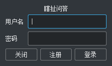
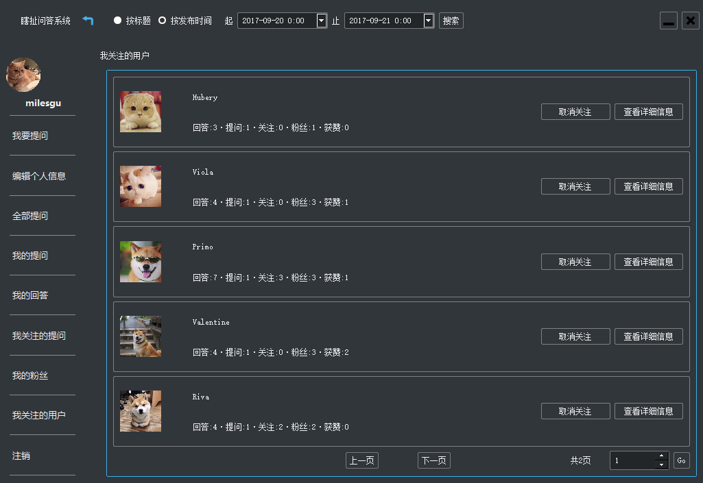

## 项目介绍
- 这是本人大学期间的C++小学期的课程设计，瞎扯问答系统，可以实现用户提问、回答的功能
- 后端采用C++编写，图形化采用qt编写。
- 未实现数据库和网络功能，数据和日志均写在文件中，可实现单机运行测试

## 项目开发环境配置
- 官网下载安装Qt5.12.2，需安装Qt charts等模块，建议全部安装
- IDE：Qt Creator
- 编译器: MinGW32，建议安装使用Qt自带的

## 项目实现要点
- 用户名判重，新注册用户的用户名不能和老用户的用户名相同
- 设置了性别、生日、头像、个人介绍等个人信息并可进行更改（查看他人信息的功能将在第二版本完善）
- 提问标题和详细描述、回答都通过继承原有QTextEdit的方式限制了字数
- 分页可输入页号进行跳转
- 除了可关注提问者、回答者，还可关注提问，并可查看自己关注的提问列表。
- 所有三种类型的提问列表均可点击相应按钮进入提问详情页，显示提问标题及所有回答
- 关注提问者、回答者等功能会判断是否为当前登录用户，若是，则不再显示这两个按钮
- 除了可以看我的关注列表，还可以看我的粉丝列表（查看信息功能将在第二版本完善）
- 限制了每个人对每个回答只能点赞一次
- 利用栈实现了返回上一页功能
- 分页控件以抽象类的方式进行了封装，包含一个纯虚函数和两个虚函数

## 演示
- 登录界面
    - 
- 注册
    - 
- 主界面
    - 
- 按标题搜索
    - 
- 按时间搜索
    - 
- 个人信息
    - 
- 发起提问
    - 
- 全部提问
    - 
- 提问详情
    - 
- 编辑回答
    - 
    - 
- 我的提问
    - 
- 我的回答
    - 
- 我关注的提问
    - 
- 我的粉丝
    - 
- 我关注的用户
    - 
- 查看他人信息
    - 
    